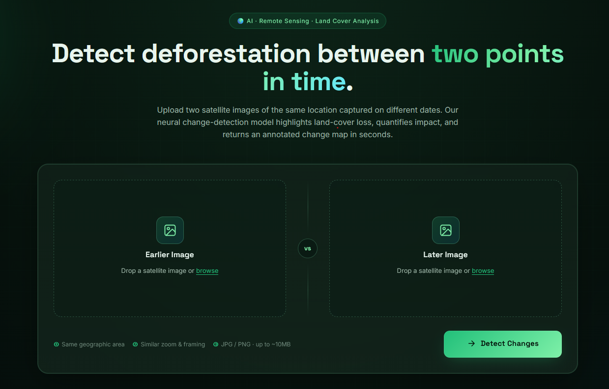

# 🌳 AI-Powered Deforestation Detection using Satellite Imagery

An end-to-end deep learning application that detects land-cover changes between two satellite images captured at different times. The system classifies image patches using a fine-tuned ResNet-50 model and highlights regions where significant changes have occurred.

---

## 📌 Features

- Upload two satellite images of the same location captured at different dates.
- Automatic land-cover classification using a fine-tuned ResNet-50 model.
- Patch-based change detection pipeline.
- Visual highlighting of changed regions.
- Interactive Flask web application for inference.
- End-to-end workflow from image upload to change map generation.

---

## 🛠️ Tech Stack

- Python
- PyTorch
- Flask
- OpenCV
- NumPy
- Pillow
- SciPy
- HTML / CSS

---

## 🧠 Model

- Backbone: ResNet-50
- Transfer Learning
- Fine-tuned on the EuroSAT dataset
- 10 Land Cover Classes

Classes:
- Annual Crop
- Forest
- Herbaceous Vegetation
- Highway
- Industrial
- Pasture
- Permanent Crop
- Residential
- River
- Sea/Lake

---

## ⚙️ Project Workflow

```text
Satellite Image (Time 1)
            +
Satellite Image (Time 2)
            │
            ▼
Image Patch Extraction (64×64)
            │
            ▼
ResNet-50 Land Cover Classification
            │
            ▼
Patch-by-Patch Comparison
            │
            ▼
Changed Region Detection
            │
            ▼
Visualization of Detected Changes
```

---

## 📂 Project Structure

```text
deforestation_project
│
├── app.py
├── src/
│   ├── train.py
│   ├── evaluate.py
│   ├── predict.py
│   ├── patch_predict.py
│   ├── change_detection.py
│   ├── visualize_changes.py
│   ├── model.py
│   └── postprocess.py
│
├── templates/
├── static/
├── models/
├── requirements.txt
└── README.md
```

---

## 🚀 Running the Project

Clone the repository

```bash
git clone <repository-url>
```

Install dependencies

```bash
pip install -r requirements.txt
```

Place the trained model inside:

```text
models/best_model.pth
```

Start the Flask application

```bash
python app.py
```

Open:

```text
http://127.0.0.1:5000
```

Upload two satellite images and click **Detect Changes**.

---

## 📊 Results

The application:

- Predicts land-cover classes for each image patch.
- Compares both timestamps.
- Detects changed regions.
- Generates a visual change map highlighting detected changes.

---

## 🔮 Future Improvements

- Semantic segmentation (U-Net / DeepLabV3+) for pixel-level detection.
- Confidence-based filtering.
- Interactive before/after comparison slider.
- Support for multi-spectral Sentinel-2 bands.
- Area estimation of detected deforestation.
- Cloud masking and preprocessing.

---
